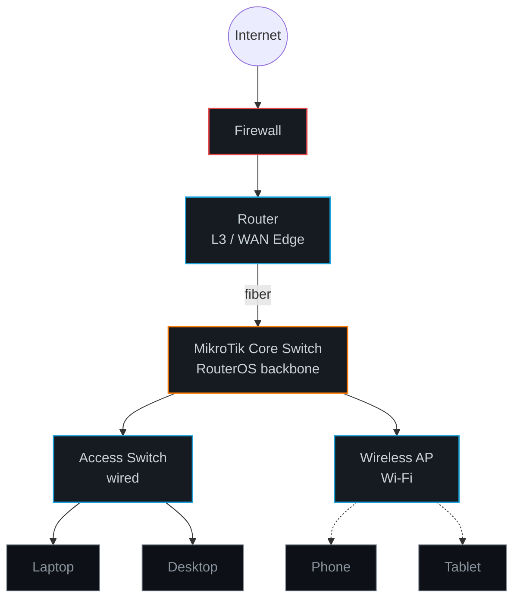

 

---

### About Me

Kosovo &nbsp;·&nbsp; CCNA-certified (Cisco) &nbsp;·&nbsp; ex-IT Coordinator @ Kuvendi i të Rinjve të Prizrenit &nbsp;·&nbsp; AL / EN / DE

### Tech & Tools

### Network Stack

### Certifications

| Certification | Issuer | Issued |
|---|---|---|
| Networking Basics | Cisco | Jan 2025 |
| Introduction to IoT | Cisco | Jan 2025 |
| Introduction to Networks | Cisco (CCNA) | Jul 2026 |
| Switching, Routing & Wireless Essentials | Cisco (CCNA) | Aug 2026 |

### Verified Badges

<table>
<tr>
<td align="center" width="160">

 <b>Networking Basics</b> 

</td>
<td align="center" width="160">

 <b>Introduction to IoT</b> 

</td>
<td align="center" width="160">

 <b>Introduction to Networks</b> 

</td>
<td align="center" width="160">

 <b>Switching, Routing & Wireless</b> 

</td>
</tr>
</table>

Click a badge to view its verified Credly credential.

### Contribution Snake

<picture>
  <source media="(prefers-color-scheme: dark)" srcset="https://raw.githubusercontent.com/pervizajerdrin/pervizajerdrin/output/github-contribution-grid-snake-dark.svg" />
  
</picture>

---

[pervizajerdrin](https://github.com/pervizajerdrin) · Kosovo

